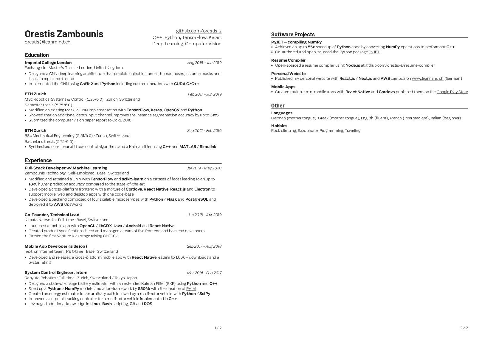

# Resume Compiler

A resume compiler with Markdown support. Converts a JSON serialized resume to PDF format.

Compatible with Google resume guidelines.

[Demo Resume](example/output/Resume_Orestis_Zambounis.pdf)



## Prerequisites

`node v12` and `"type": "module"` enabled

## Install

```bash
yarn add https://github.com/orestis-z/resume-compiler.git
```

## Example Usage

```js
import resumeCompiler, { cvChild } from "resume-compiler";

const profile = {
  name: "Orestis Zambounis",
  title: "MSc ETH Robotics Engineer",
  birthdate: "10.7.1991",
  address: "CH-4103 Bottmingen",
  phone: "+41 78 637 35 91",
  email: "orestis@leanmind.ch",
  github: "github.com/orestis-z",
  programmingLanguages:
    "C++, Python, TensorFlow, Keras, Deep Learning, Computer Vision",
};

const cv = [
  {
    title: "Experience",
    children: [
      cvChild(
        "Experience 1",
        ["Meta Infos", "Location A"],
        ["Sep 2010", "Today"],
        "* Here comes the __Markdown__ description of your achievement"
      ),
      cvChild(
        "Experience 2",
        ["Meta Infos", "Location B"],
        ["Aug 2005", "Dec 2009"],
        "* Here's another __Markdown__ description\n * Improved X by Y by doing Z"
      ),
    ],
  },
  {
    title: "Software Projects",
    children: [
      cvChild(
        "Personal Website",
        null,
        null,
        "* Published my personal website with __React.js__ / __Next.js__ and __AWS__ Lambda on <a href='https://leanmind.ch'>www.leanmind.ch</a> (German)"
      ),
    ],
  },
  {
    mini: true,
    title: "Other",
    children: [
      cvChild(
        "Languages",
        [
          "German (mother tongue)",
          "English (fluent)",
          "French (intermediate)",
          "Italian (beginner)",
        ],
        null
      ),
      cvChild(
        "Hobbies",
        ["Rock climbing", "Saxophone", "Programming", "Traveling"],
        null
      ),
    ],
  },
];

resumeCompiler({
  profile,
  cv,
  google: true,
});
```

## Config

| Prop                  | description                                                                                                         | default value       |
| --------------------- | ------------------------------------------------------------------------------------------------------------------- | ------------------- |
| `profile`             | Object containing personal information `{name, title, address, phone email, github, programmingLanguages, summary}` | `{}`                |
| `cv`                  | Array containing sections and section-children `[{title, children: [{title, subtitles, meta, body}, ...]}, ...]`    | `[]`                |
| `fonts`               | Absolute path to font files (`ttf` or `woff`)                                                                       | Roboto and OpenSans |
| `pageCountOn`         | Display page count                                                                                                  | `true`              |
| `color`               | Font color                                                                                                          | `#212121`           |
| `linkColor`           | Link font color                                                                                                     | `#212121`           |
| `mainTitleSize`       | Size of main document title                                                                                         | `24`                |
| `subtitleSize`        | Size of main document subtitle                                                                                      | `12`                |
| `headerSize`          | Size of the section headers                                                                                         | `13`                |
| `fontSize`            | Body text font size                                                                                                 | `10`                |
| `lineHeight`          | Body text line height                                                                                               | `1`                 |
| `unbreakableChildren` | Don't allow children to break to new page                                                                           | `false`             |
| `pageMargins`         | Document page margins                                                                                               | `[60, 65, 60, 65]`  |
| `google`              | Google style resume                                                                                                 | `false`             |
